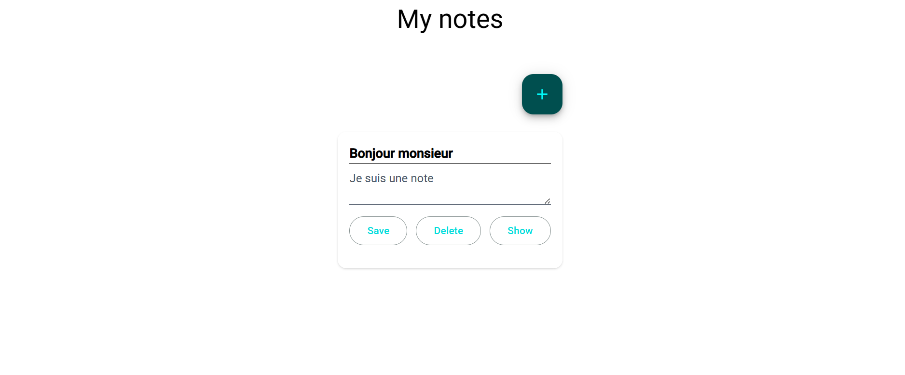

# Notes App — Quarkus + Angular

This is a simple test project to integrate a Quarkus backend API with an Angular frontend application.

---



## Technologies Used

- **Backend:** [Quarkus](https://quarkus.io/) (Java 21)
- **Frontend:** [Angular](https://angular.io/) (version X.X)
- **Database:** PostgreSQL
- **Test:** Junit & Jest

---

## Prerequisites

- Java 21 or higher
- Maven
- Node.js and npm
- PostgreSQL


---

## Running the Backend (Quarkus)

1. Environment Variables (Backend)

Database configuration can also be managed through environment variables.
An example file is provided: env.sample


``` sh
POSTGRES_USERNAME=postgres
POSTGRES_PASSWORD=1234
POSTGRES_URL=jdbc:postgresql://localhost:5432/notes-test
```

To use it, create your own .env file in the back directory:

cp back/env.sample back/.env

2. Start the backend
```sh
cd back
./mvnw quarkus:dev
```


## Running the Frontend (Angular)
1. Install frontend dependencies:
```sh
cd frontend
npm install
```

2. Run the Angular development server:

```sh
npm start
```
The frontend will be available at http://localhost:4200.


## Testing

### Run backend tests with:
```sh
cd back
./mvnw test
```

### Run frontend tests with:
```sh
cd front
npm test
```
